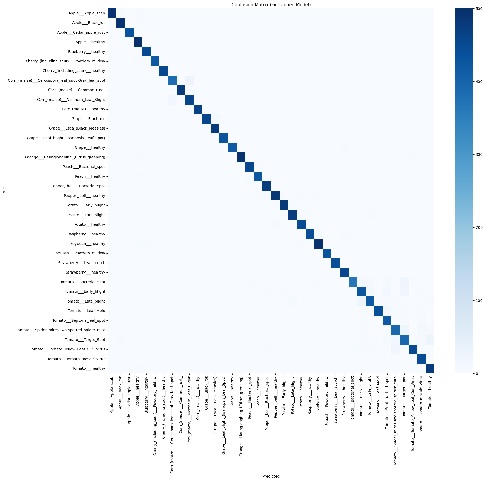

# AgriSmart AI — Model Report

## Task
Multi-class image classification of plant leaf diseases. Given a photo of a crop leaf,
the model predicts one of 38 classes, covering multiple crop species (Apple, Tomato,
Corn, Grape, Potato, Pepper, Strawberry, Soybean, and others) and their associated
diseases, or "healthy" for unaffected leaves.

## Dataset & Split
- **Source:** New Plant Diseases Dataset (Augmented) — a PlantVillage-derived dataset,
  publicly available on Kaggle:
  [New Plant Diseases Dataset](https://www.kaggle.com/datasets/vipoooool/new-plant-diseases-dataset)
- **License:** copyright-authors (as listed on the Kaggle dataset page)
- **Classes:** 38 crop-disease categories (including healthy classes)
- **Training set:** 70,295 images
- **Validation set:** 17,572 images
- **Split:** used the dataset's pre-existing train/valid folder split, no further
  splitting was performed

## Model / Approach
Architecture based on a standard ResNet50 transfer-learning pattern, adapted from a
public reference implementation (see README's Originality Declaration for details).

- **Architecture:** ResNet50 with transfer learning
  - Pretrained ImageNet weights
  - Custom classification head: `GlobalAveragePooling2D → Dense(128, relu) →
    Dense(64, relu) → Dense(38, softmax)`
  - Preprocessing (`preprocess_input`, ImageNet channel normalization) built directly
    into the model graph via a `Lambda` layer, so raw images can be passed to the
    model without separate preprocessing at inference time
- **Total parameters:** 23,860,710

### Phase 1 — Initial Training (Frozen Backbone)
- Base ResNet50 layers frozen (`trainable=False`); only the custom head
  (272,998 parameters) trained
- Optimizer: Adam, Loss: categorical cross-entropy, Batch size: 32
- Epochs: 30 (no early stopping triggered; validation accuracy kept improving
  intermittently through the full run)
- Callbacks: `ModelCheckpoint` (best model by validation accuracy),
  `EarlyStopping` (patience 7, did not trigger), `ReduceLROnPlateau` (patience 5)
- **Data augmentation** (training data only, to address the lab-to-field
  generalization gap the challenge is designed around): rotation (±20°), horizontal
  and vertical flips, brightness variation (0.7–1.3x), shear, zoom, width/height
  shifts. This goes beyond the augmentation in the baseline reference notebook this
  work was adapted from (see Originality Declaration in README), specifically to
  target generalization beyond clean, lab-condition images.
- Result: 94.83% accuracy, 0.9487 macro-F1

### Phase 2 — Fine-Tuning (Partial Unfreezing)
- The last ~30 layers of the ResNet50 backbone were unfrozen, allowing them to adapt
  to leaf-specific visual features rather than relying purely on generic ImageNet
  features
- Recompiled with a much lower learning rate (Adam, `lr=1e-5`) to avoid destabilizing
  the pretrained weights
- Continued training for up to 10 further epochs (`EarlyStopping` patience 5,
  `ReduceLROnPlateau` patience 3), starting from the Phase 1 weights
- Result: 97.06% accuracy, 0.9703 macro-F1 — a clear, consistent improvement over
  Phase 1 across nearly all classes

## Metric & Result
Evaluated on the full validation set (17,572 images), final (fine-tuned) model:

| Metric | Score |
|---|---|
| Accuracy | 97.06% |
| Macro-F1 | 0.9703 |
| Weighted-F1 | 0.9706 |

For comparison, the Phase 1 (pre-fine-tuning) model scored 94.83% accuracy / 0.9487
macro-F1 on the same validation set.

Per-class precision/recall/F1 and the full confusion matrix were computed
(see [`confusion_matrix.png`](confusion_matrix.png) below, and the
[training notebook](../model/training.ipynb) for the full per-class breakdown and
the Phase 1 vs. Phase 2 comparison).

## Baseline
No official baseline metric was published to our team for this challenge. Our
reported macro-F1 (0.9703) reflects performance on our own held-out validation split
of the public training dataset, not on an independent test set.

## Limitations
- **Validation, not true held-out testing:** our validation set is drawn from the
  same lab-condition source distribution (clean backgrounds, controlled lighting) as
  our training data. The problem statement explicitly notes that models trained this
  way often perform well on further lab-condition images but degrade on real
  field-condition photos (natural lighting, clutter, occlusion). We addressed this
  with augmentation targeting these conditions, and manual testing with real-world
  field photos (natural lighting, motion blur, cluttered backgrounds, off-angle
  framing) showed reduced accuracy compared to lab-condition validation images,
  consistent with this generalization challenge. Our reported metrics reflect
  lab-condition validation performance, not field-image performance.
- **Class confusion cluster (Tomato diseases):** fine-tuning meaningfully reduced,
  but did not eliminate, a confusion cluster among Tomato Early Blight, Late Blight,
  Target Spot, and Bacterial Spot — likely due to visually overlapping symptoms
  (irregular brown/necrotic leaf lesions) across these categories. Tomato Target
  Spot precision improved from 0.63 (Phase 1) to 0.83 (Phase 2) but remains the
  weakest-performing class overall.
- **Concrete example:** a Tomato Early Blight validation image that Phase 1
  misclassified as Target Spot (46% confidence) was correctly classified as Early
  Blight after fine-tuning (92% confidence) — see the notebook's "Concrete
  Improvement Example" section.
- **Secondary confusion (Corn diseases):** a smaller, similar pattern appears
  between Corn Cercospora Leaf Spot / Gray Leaf Spot and Corn Northern Leaf Blight.

## Files
- Full training/evaluation notebook: [`/model/training.ipynb`](../model/training.ipynb)
- Trained model weights: hosted on Google Drive (see [README](../README.md) for link
  and load instructions — `load_weights()`, not `load_model()`, due to a Keras
  Lambda-layer serialization limitation)
- Class-index mapping: `class_indices.json` (hosted alongside weights on Drive)

